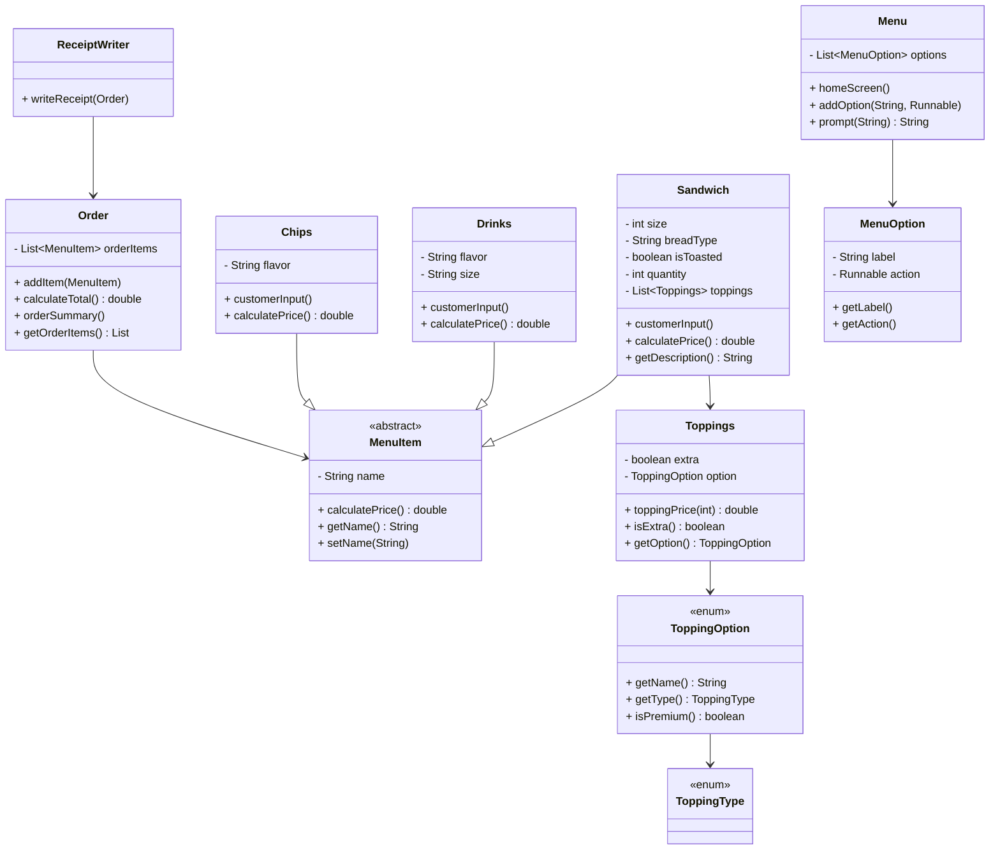

# **Baratie Sandwich Shop 🍔⚓**

A Java console-based ordering system inspired by the Baratie restaurant from *One Piece*.
Customers can build sandwiches, choose toppings, add drinks and chips, and generate a receipt saved to a file.

---

## **📌 Features**

### ✔ Menu System

A reusable `Menu` class that displays numbered options and executes actions using `Runnable`.

### ✔ Sandwich Builder

Customers can customize:

* Size (4”, 8”, 12”)
* Bread type
* Toasting
* Toppings (with premium + extra pricing)
* Quantity

### ✔ Additional Items

* Drinks (S, M, L with flavor)
* Chips (flavor)

### ✔ Receipt Writer

Automatically generates a receipt file in the `Receipts/` folder after checkout.

### ✔ Clean OOP Design

* **Inheritance** (`Sandwich`, `Drinks`, `Chips` → `MenuItem`)
* **Enums** (`ToppingOption`, `ToppingType`)
* **Composition** (`Order` contains a list of `MenuItem`)
* **Utility Classes** (`ReceiptWriter` for file output)

---

## **📂 Project Structure**

```
src/
└── com/pluralsight/
    ├── Main.java
    ├── models/
    │   ├── MenuItem.java
    │   ├── Sandwich.java
    │   ├── Drinks.java
    │   ├── Chips.java
    │   ├── Order.java
    │   ├── Toppings.java
    │   ├── ToppingOption.java
    │   └── ToppingType.java
    ├── ui/
    │   ├── Menu.java
    │   └── MenuOption.java
    └── util/
        └── ReceiptWriter.java
```

---

## **🧠 How It Works**

### **1️⃣ Start the App**

The user sees the **Home Menu**:

* Start New Order
* Exit

### **2️⃣ Build an Order**

The **Order Menu** lets the user:

* Add Sandwich
* Add Drink
* Add Chips
* Checkout

### **3️⃣ Sandwich Customization**

Users select toppings **by number**, not yes/no prompts.

### **4️⃣ Checkout & Receipt**

After checkout:

* Order summary prints to console
* A receipt file is created:

```
Receipts/receipt_1731563600000.txt
```

---

## **🧾 Example Receipt Output**

```
========= Baratie Sandwich Shop Receipt =========

Date: 2025-11-14T03:56:46
Items:
2x 12" Sandwich on white (Toasted)
  - Chicken (extra)
  - Ranch
  Subtotal: $26.00

=============================
Subtotal: $26.00
Tax:      $1.30
Total:    $27.30
=============================

Thank you for visiting Baratie!
```

---

## **💾 Running the Program**

1. Clone the repository:

   ```
   git clone https://github.com/<your-username>/BaratieSandwich.git
   ```
2. Open the project in IntelliJ IDEA (recommended).
3. Run `Main.java`.
4. Follow the menu prompts to build your order.

---

## **🚀 Future Enhancements**

Potential add-ons:

* Signature sandwiches
* Edit/remove items from an order
* Save order history (CSV/JSON)
* GUI (JavaFX)
* Discount & loyalty system
* ASCII/colored UI

---

## **📜 License**

This project is created for learning and portfolio purposes.
You are free to fork and modify it.



````md
## UML Diagram

```mermaid
<diagram here>
````

